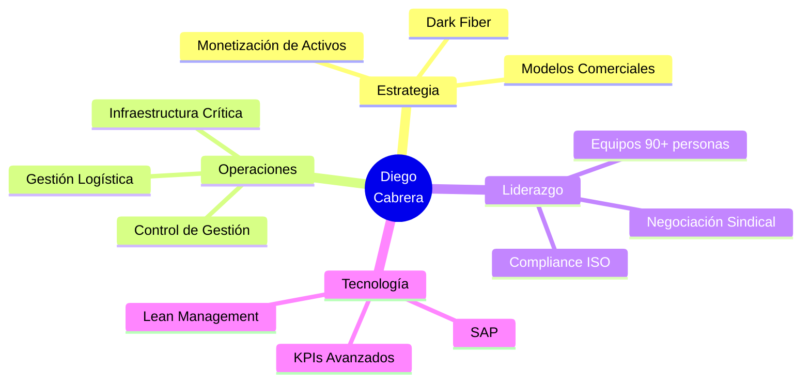

<!-- Encabezado principal -->

  <h1>📊 Diego Cabrera</h1>
  <h3>Business Operations & Infrastructure Strategy Leader</h3>
  
<em>“Transformo operaciones complejas en modelos escalables de eficiencia, rentabilidad y crecimiento. Especializado en monetizar infraestructura y convertir problemas sistémicos en resultados de negocio.”</em>

 

<!-- Badges de contacto -->

  
  
  

 

---

## 💼 Competencias Clave

| 🎯 Estrategia y Negocios | ⚙️ Operaciones | 🛡️ Infraestructura | 📊 Control de Gestión |
|-------------------------|----------------|---------------------|----------------------|
| Evolución de Negocio    | KPIs de Rendimiento | Dark Fiber           | Revenue Optimization  |
| Monetización de activos | Optimización Logística | Facility Management  | Negociación Estratégica |
| Modelos de negocio      | Gestión de Presupuesto | Seguridad Patrimonial | Lean Management       |

---

## 🏢 Experiencia Profesional

### 📌 Responsable de Negocios Auxiliares
**Autopistas del Sol / GCO** · 2026 – Presente
- Redefinición estratégica del modelo de publicidad vial hacia comunicación inteligente.
- Reconversión del modelo Ducts Leasing hacia Dark Fiber para monetización de infraestructura.
- Evaluación de oportunidades de negocio, análisis económico-financiero y articulación regulatoria.

### 🚗 Coordinador de Operaciones
**Autopistas del Sol** · Agosto 2022 – 2026
- Liderazgo de 15 supervisores y 90 peajistas.
- Negociación sindical: 30% menos liberaciones de tránsito.
- Implementación de KPIs de quiebres: mejora del 7% en tasa de cobro (reducción del 7% al 1%).

### 🔒 Jefe de Monitoreo
**Metalúrgica La Toma** · Marzo 2022 – Agosto 2022
- Reducción del 30% de incidentes vía KPIs de seguridad.
- Cero evasiones tras reorganización de CCTV (25 cámaras IP añadidas).
- 40% reducción de riesgos en trabajos en altura y autoelevadores.

### 🛡️ Jefe de Seguridad y Mantenimiento
**Falabella SA** · Junio 2008 – Octubre 2021
- Reducción de costos del 15% y rotación de personal del 30%.
- Creación de manual operativo: mejora del compliance en 20%.
- Optimización del 20% en vigilancia física y reducción del Lead Time en un 30%.

---

## 🎓 Formación Académica

| Título | Institución | Período |
|--------|-------------|---------|
| Ingeniería Industrial | UTEL (México) | 2021 – 2025 |
| Diplomado en Industria 4.0 | USAL (Argentina) | 2022 |
| Gerenciador de Seguridad | UMSA (Argentina) | 2021 |
| Gestión de Mantenimiento Industrial | Tec People (Argentina) | 2022 |

---

## 🚀 Áreas de Experiencia

📬 Contacto

    

  

  

 <em>“Convirtiendo activos subutilizados en flujos de valor escalables”</em> 
 
